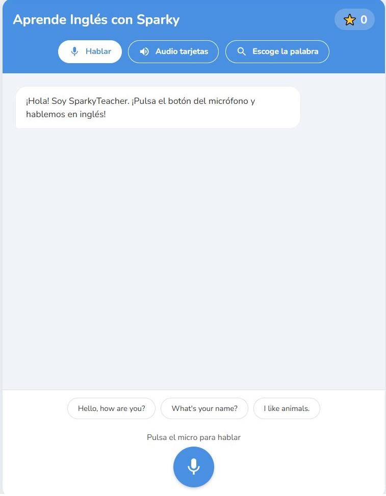
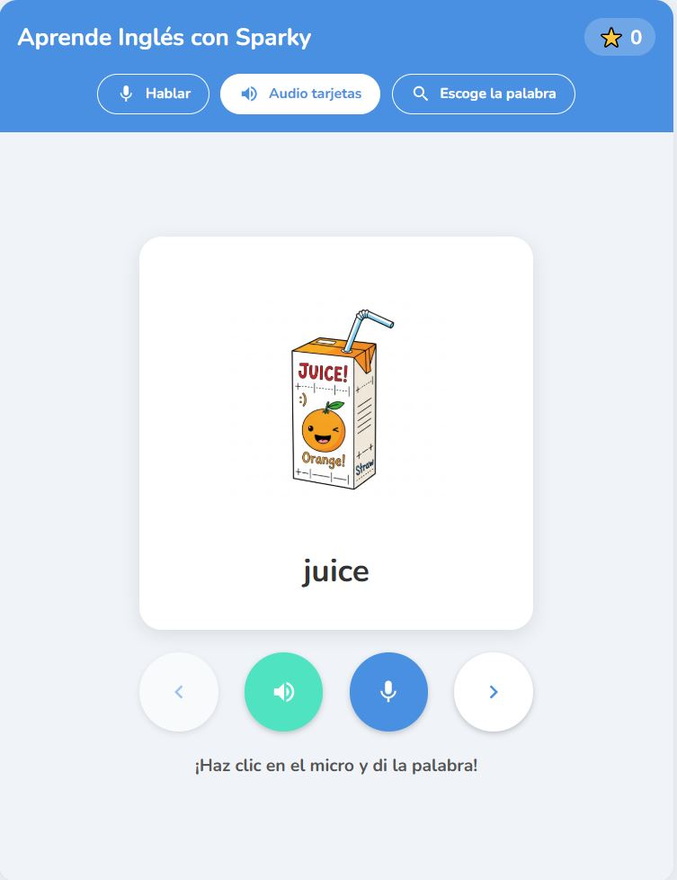
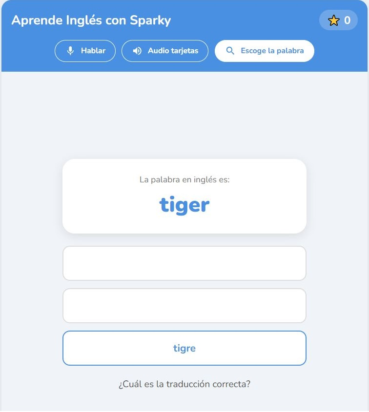

# Aprende Inglés

Aplicación web para practicar y aprender inglés de forma interactiva. Esta carpeta contiene la interfaz (frontend) creada con TypeScript y Vite.

  

## Descripción

Aprende Inglés ayuda a los usuarios a practicar vocabulario, frases y ejercicios interactivos. Ofrece actividades como completar huecos, ejercicios de escucha y repetición, y puede proporcionar retroalimentación mejorada mediante la integración con un servicio de lenguaje (opcional).

## Características principales

- Interfaz construida con TypeScript y Vite.
- Punto de entrada en `index.tsx` y estilos en `index.css`.
- Ejercicios interactivos para practicar vocabulario y frases.
- Integración opcional con un modelo de lenguaje mediante la variable de entorno `GEMINI_API_KEY` para obtener feedback inteligente.

## Estructura del proyecto

- `index.html` — plantilla HTML principal.
- `index.tsx` — punto de entrada (React + TypeScript).
- `index.css` — estilos globales.
- `package.json` — scripts y dependencias.
- `tsconfig.json`, `vite.config.ts` — configuraciones de TypeScript y Vite.

## Requisitos

- Node.js (recomendado v16 o superior).
- npm o yarn.

## Instalación y ejecución (desarrollo)

1. Instala dependencias:

```sh
npm install
```

1. (Opcional) Crea un archivo `.env.local` en la raíz del proyecto con la siguiente variable si quieres habilitar integración con un servicio de lenguaje:

```ini
GEMINI_API_KEY=tu_clave_aqui
```

1. Ejecuta la aplicación en modo desarrollo:

```sh
npm run dev
```

1. Abre tu navegador en `http://localhost:5173` (o la URL que muestre Vite).

## Construir para producción

```sh
npm run build
npm run preview
```

## Variables de entorno

- `GEMINI_API_KEY` — (opcional) clave para servicios de lenguaje que mejoran la retroalimentación. La aplicación funciona sin ella, pero con capacidades limitadas.

## Contribuir

1. Haz un fork o crea una rama nueva.
2. Añade tu mejora o corrección y escribe instrucciones o pruebas mínimas.
3. Abre un Pull Request describiendo los cambios.

<div align="center">

</div>