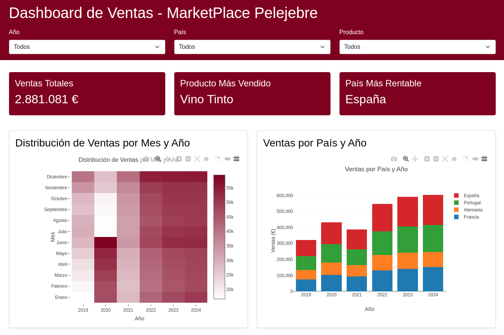
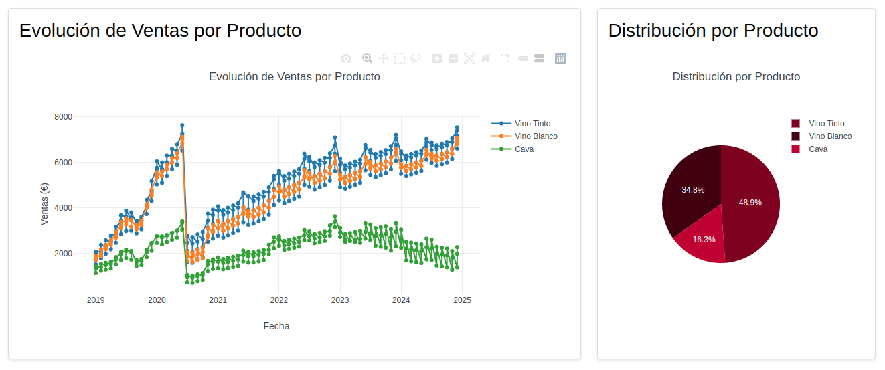

# 📊 Dashboard de Ventas - Experimento con LLM



## 🔬 Contexto Experimental

Este proyecto es un experimento de generación automática de dashboards utilizando LLM (Large Language Models). El dashboard resultante permite analizar datos de ventas de un marketplace ficticio de vinos, demostrando las capacidades de los modelos de lenguaje actuales para generar soluciones funcionales de visualización de datos.

### Detalles del Experimento
- **Modelo Utilizado**: Claude 3.5 Sonnet
- **Tiempo Total**: < 5 minutos
- **Interacciones**: 3 conversaciones con el LLM
- **Prompt Original**: Disponible en `prompt.txt` en el repositorio

## ⭐ Características

- 1️⃣ Visualizaciones interactivas:
  - Mapa de calor de ventas por mes/año
  - Gráfica de barras apiladas por país
  - Evolución temporal de ventas por producto
  - Distribución de ventas en gráfica circular
  - Tabla de datos filtrable
- 2️⃣ Filtros dinámicos por:
  - Año
  - País
  - Producto
- 3️⃣ Resumen estadístico:
  - Ventas totales
  - Producto más vendido
  - País más rentable

## 📊 Conclusiones del Experimento

### Resultados Destacables
- Generación completa de un dashboard funcional en menos de 5 minutos
- Solo 3 interacciones necesarias para obtener un resultado productivo
- Código limpio y bien estructurado generado automáticamente

### Implicaciones
- Los LLM actuales facilitan el desarrollo rápido de soluciones de visualización
- Personas con conocimientos limitados de programación pueden abordar proyectos complejos
- Reducción significativa del tiempo de desarrollo para prototipos funcionales

### Limitaciones y Consideraciones
- El resultado es un prototipo que puede requerir ajustes
- Importante revisar y validar el código generado
- Necesario entender los conceptos básicos para realizar modificaciones

Este ejemplo está basado en datos ficticios, si bien se puede adaptar para cualquier caso de uso que se nos ocurra. Quizá en el futuro incluya algún caso con datos reales.

## 🛠️ Requisitos Previos

- Git
- Python 3.x
- Navegador web moderno (Chrome, Firefox, Edge)

## ⚙️ Instalación

### 1. Clonar el repositorio

```bash
# Clonar el proyecto
git clone https://github.com/tu-usuario/marketplace-pelejebre-dashboard.git

# Navegar al directorio del proyecto
cd marketplace-pelejebre-dashboard
```

### 2. Verificar estructura del proyecto

```plaintext
dashboard_sales/
├── dashboard.html      # Interfaz principal del dashboard
├── dashboard.js       # Lógica y visualizaciones
├── historico.csv     # Datos de ventas
└── README.md         # Documentación
```

## 🚀 Uso

### 1. Iniciar el servidor local

```bash
# Navegar al directorio del dashboard
cd /home/pelejebre/Documentos/playing_with_IA/dashboard_sales/

# Iniciar servidor Python en puerto 8000
python3 -m http.server 8000
```

### 2. Acceder al dashboard

1. Abrir el navegador web
2. Navegar a: `http://localhost:8000/dashboard.html`
3. Verificar que los gráficos se cargan correctamente

### 3. Alternativas de servidor

Si el puerto 8000 está ocupado:
```bash
# Usar puerto alternativo
python3 -m http.server 8081

## 🔧 Solución de Problemas

### Problemas Comunes

| Problema | Solución |
|----------|----------|
| Error al cargar datos | - Verificar que `historico.csv` existe en el directorio<br>- Comprobar formato del CSV<br>- Revisar permisos de lectura |
| Visualizaciones no aparecen | - Abrir consola del navegador (F12)<br>- Verificar errores en la consola<br>- Comprobar conexión a CDNs |
| Servidor no inicia | - Verificar que puerto 8000 está libre<br>- Intentar con otro puerto: `python3 -m http.server 8081`<br>- Comprobar permisos de Python |

### Verificación del CSV

```bash
# Verificar existencia y permisos del CSV
ls -l historico.csv

# Verificar formato del CSV
head -n 5 historico.csv
```

## 🤝 Contribuciones

Las contribuciones son bienvenidas. Por favor, sigue estos pasos:

1. Fork del proyecto
2. Crear rama para tu función:
   ```bash
   git checkout -b feature/NuevaFuncionalidad
   ```
3. Commit de cambios:
   ```bash
   git commit -m 'Añade nueva funcionalidad'
   ```
4. Push a tu rama:
   ```bash
   git push origin feature/NuevaFuncionalidad
   ```
5. Abrir Pull Request

### Guía de Contribución

- Mantener el estilo de código existente
- Añadir comentarios para código nuevo
- Actualizar README si es necesario
- Crear tests para nuevas funcionalidades
