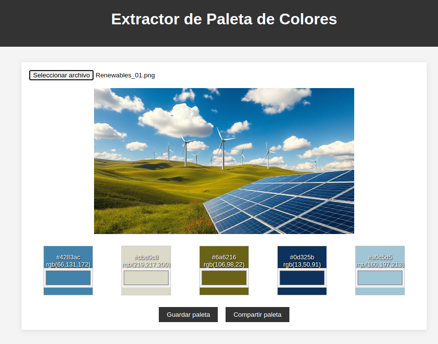
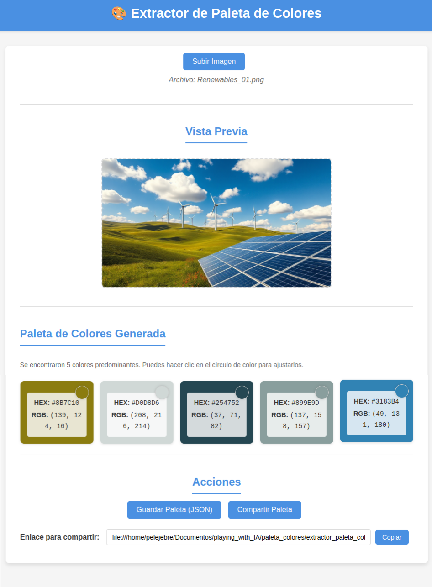
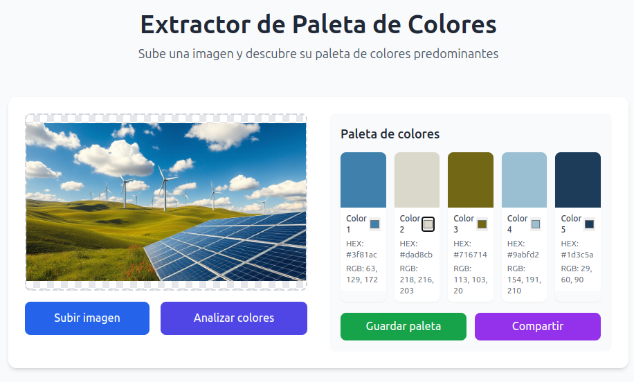

# 🎨 Análisis de Extractores de Paleta de Colores

## 📌 Introducción

Los **Extractores de Paleta de Colores** son herramientas fundamentales en el diseño web y gráfico, permitiendo identificar y extraer los colores predominantes de una imagen. Estas herramientas facilitan la creación de diseños coherentes y armónicos, garantizando que los elementos visuales compartan una estética unificada.

La extracción de colores utiliza diversos algoritmos, desde simples muestreos hasta técnicas avanzadas como la cuantización de color mediante el algoritmo de "Median Cut" o "K-means clustering".

¿Y si le pedimos a un LLM que nos facilite un código en `HTML` para implementar un extractor de paleta de colores? ¿Y si comparamos diferentes implementaciones para evaluar sus características y rendimiento?

## 🔍 Metodología del Experimento

En este experimento, evaluamos diferentes implementaciones de extractores de paleta de colores desarrollados con HTML, CSS y JavaScript. El objetivo es comparar sus características, rendimiento y usabilidad, analizando cómo cada implementación aborda desafíos como:

- Algoritmos de extracción de color
- Interfaz de usuario y experiencia de usuario
- Funcionalidades adicionales (guardar, compartir, editar colores)

## 🔎 Análisis de implementaciones y sus características

Las diferentes implementaciones pueden variar en varios aspectos:

- **Algoritmos utilizados:** Algunas implementaciones utilizan bibliotecas como Color Thief, mientras que otras implementan algoritmos propios o incorporan el código directamente.
- **Interfaz y diseño:** Desde interfaces minimalistas hasta diseños más elaborados con frameworks como Tailwind CSS.
- **Funcionalidades:** Opciones para guardar paletas, compartirlas mediante enlaces, editar colores manualmente, etc.
- **Manejo de errores:** Algunas implementaciones ofrecen un manejo más robusto de situaciones excepcionales.

## 📊 Comparativa entre implementaciones

| Implementación        | Algoritmo            | Framework CSS | Edición de Colores | Compartir | Rendimiento |
| --------------------- | -------------------- | ------------ | ------------------ | --------- | ----------- |
| GPT-4 Turbo           | Color Thief (CDN)    | Vanilla CSS  | ✅                 | ✅        | ⭐⭐⭐⭐       |
| Gemini 2.5 Pro        | Color Thief (Integrado)| Vanilla CSS  | ✅                 | ✅        | ⭐⭐⭐⭐⭐     |
| Deepsite              | Color Thief (CDN)    | Tailwind CSS | ✅                 | ✅        | ⭐⭐⭐⭐       |

## 📸 Screenshots

| GPT-4 Turbo | Gemini 2.5 Pro | Deepsite |
|:-----:|:----------:|:---------:|
|  |  |  |

## 📜 Conclusión 🤔

Los extractores de paleta de colores son herramientas versátiles que pueden implementarse de diversas formas, cada una con sus ventajas y desafíos. En este experimento, hemos analizado tres implementaciones diferentes generadas por modelos de lenguaje, evaluando su enfoque técnico y características.

La implementación de Gemini 2.5 Pro destaca por tener el algoritmo Color Thief integrado directamente en su código, ofreciendo un mejor control sobre el procesamiento y manejo de errores más robusto. Incluye optimizaciones específicas como el uso de `willReadFrequently: true` para el contexto del canvas, mejorando el rendimiento en operaciones repetitivas de lectura de píxeles.

Las implementaciones de GPT-4 Turbo y Deepsite utilizan Color Thief a través de CDN, lo que simplifica el código pero depende de servicios externos. Deepsite complementa esto con una interfaz moderna utilizando Tailwind CSS, mejorando significativamente la experiencia visual.

La comparación de estos extractores demuestra que los modelos de lenguaje actuales pueden generar código funcional y sofisticado para casos de uso prácticos. Las tres implementaciones ofrecen funcionalidades similares (extracción de colores, edición manual, guardado en JSON y compartir mediante enlaces), pero con diferentes enfoques técnicos y de diseño.

Estas herramientas pueden servir como base para proyectos más complejos de diseño y análisis de color, siendo particularmente útiles para desarrolladores y diseñadores que buscan mantener coherencia en sus proyectos visuales.

## 💻 Archivos HTML

A continuación, encontrarás los enlaces a los archivos HTML de cada implementación. Haz clic en cada enlace para abrir los archivos en una nueva pestaña del navegador:

- <a href="extractor_paleta_colores_GPT_4_Turbo.html" target="_blank">Extractor de Paleta de Colores - Implementación GPT-4 Turbo</a>
- <a href="extractor_paleta_colores_Gemini_2.5_Pro_Preview_03_25.html" target="_blank">Extractor de Paleta de Colores - Implementación Gemini 2.5 Pro</a>
- <a href="extractor_paleta_colores_Deepsite.html" target="_blank">Extractor de Paleta de Colores - Implementación Deepsite</a>

## 🔗 Referencias

- [Color Thief - Biblioteca para extracción de colores](https://lokeshdhakar.com/projects/color-thief/)
- [Algoritmo de Cuantización de Color Median Cut](https://en.wikipedia.org/wiki/Median_cut)
- [Diseño basado en paletas de colores](https://www.smashingmagazine.com/2016/04/web-developer-guide-color/)

---

¡Espero que este análisis te haya resultado interesante! 🚀
