# 🐍 Análisis de Implementaciones del Juego SNAKE

## 📌 Introducción

El juego **SNAKE** es un clásico de los videojuegos, conocido por su mecánica sencilla pero desafiante. Fue creado originalmente en 1976 por **Gremlin Industries** como un juego arcade llamado *Blockade*. Sin embargo, la versión más popular fue la que apareció en los teléfonos Nokia en 1997, convirtiéndose en un fenómeno mundial.

A lo largo del tiempo, se han desarrollado múltiples versiones y enfoques para implementarlo, desde algoritmos básicos hasta técnicas avanzadas de optimización e inteligencia artificial.

¿Y si le pedimos a un LLM que nos facilite un código en `HTML` para que implemente este juego? ¿Y si se lo pedimos a varios LLMs y valoramos la capacidad resolutiva de cada uno de ellos ante el mismo `prompt` y con una sola oportunidad?

## 🔍 Metodología del Experimento

En este experimento, evaluamos las capacidades de diferentes modelos de lenguaje (LLMs) para generar código `HTML` para un juego básico como el *snake*, con el objetivo de determinar su capacidad para facilitar tareas de código y agilizar el proceso de desarrollo, permitiendo a los desarrolladores centrarse en aspectos más complejos y creativos del proyecto.

Para evaluar el rendimiento de diferentes modelos de lenguaje en la generación de código, se utilizó un mismo `prompt` detallado para todos los modelos. El `prompt` proporcionado fue el siguiente:

> **Genera un juego Snake utilizando HTML, CSS y JavaScript.**
>
> **(1)** La interfaz debe incluir un área de juego dentro de un recuadro donde se moverá la serpiente y, debajo, un botón "PLAY" para iniciar el juego. Incluye un título multicolor tipo arcade pixelado encima del recuadro que indique "SNAKE GAME", cada letra será de un color.
>
> **(2)** La serpiente iniciará con un solo segmento y se moverá en respuesta a las flechas del teclado.
>
> **(3)** A medida que consuma premios generados aleatoriamente en la pantalla, crecerá en longitud.
>
> **(4)** Condiciones de finalización:
> - La serpiente alcanza una longitud de 20.
> - Choca con las paredes del área de juego.
> - Choca consigo misma.
>
> **(5)** Cuando la serpiente colisione, cambiará de color verde a rojo, aparecerá un mensaje "GAME OVER", y el usuario podrá elegir entre reiniciar el juego o salir.
>
> **(6)** Extras a considerar para mejorar la experiencia:
> - Velocidad progresiva: opción para aumentar ligeramente la velocidad conforme la serpiente crece.
> - Estética: se recomienda un diseño moderno con CSS para mejorar la experiencia visual.
> - Estructura del código: utilizar una clase en JavaScript para manejar la lógica del juego de forma organizada.
> - Efectos y animaciones: agregar una animación de movimiento fluido para mejorar la experiencia.
>
> **(7)** Genera todo el código dentro del HTML.

---

## 🔎 Análisis de modelos y su capacidad generativa

Diferentes modelos de lenguaje pueden responder de manera variable a un mismo `prompt` debido a múltiples factores:

- **Conocimiento previo del juego:** Algunos modelos pueden haber sido entrenados con datos que incluyen implementaciones de SNAKE, lo que podría llevar a un cierto grado de *overfitting*, generando código basado en ejemplos conocidos en lugar de interpretar el `prompt` desde cero.
- **Capacidad de razonamiento:** Modelos más avanzados en razonamiento pueden descomponer mejor la tarea en sus partes fundamentales, asegurando una implementación más estructurada y sin omitir detalles importantes.
- **Optimización del código:** Algunos modelos tienden a generar código más modular y limpio, mientras que otros pueden producir soluciones funcionales pero menos organizadas.
- **Capacidad de manejo de instrucciones:** Modelos con mejor alineación hacia tareas complejas pueden seguir el `prompt` de manera más estricta, mientras que otros pueden omitir ciertos detalles o interpretarlos de manera distinta.

---

## 📊 Comparativa entre modelos de lenguaje

| Modelo LLM  | Aspecto de la App | Jugabilidad | Requiere Mejoras | Interpretación del Prompt |
| ----------- | ----------------- | ----------- | ---------------- |------------------------| 
| GPT-4       | ⭐⭐⭐⭐              | ✅           | NO                | ⭐⭐⭐⭐ |               
| GPT-5 Codex | ⭐⭐⭐⭐              | ✅           | NO                | ⭐⭐⭐⭐ |
| Claude 3.5  | ⭐⭐⭐⭐               | ✅           | NO                | ⭐⭐⭐⭐ |
| Claude 4.5  | ⭐⭐⭐⭐               | ✅           | NO                | ⭐⭐⭐⭐ |
| Grok Code Fast1 | ⭐⭐⭐          | ✅           | NO                | ⭐⭐⭐⭐ |
| DeepSeek R1 | ⭐                | ❌           | YES                | ⭐ |                    
| Gemini 2.0  | ⭐⭐               | ✅           | SOME                | ⭐⭐⭐ | 
| Gemini 2.5 Pro  | ⭐⭐⭐⭐               | ✅           | NO                | ⭐⭐⭐⭐ | 
| Llama 3.3   | ⭐⭐⭐⭐                | ✅          | SOME                | ⭐⭐⭐ | 
| Phi 4       | ⭐⭐⭐               | ✅           | ❌                | ⭐⭐⭐ | 
| Qwen 2.5    | ⭐                | ❌         | YES                | ⭐ | 

---

## 📸 Screenshots

| GPT-4 | GPT-5 Codex | Claude 3.5 | Claude 4.5 |
|:-----:|:----------:|:---------:|:---------:|
| 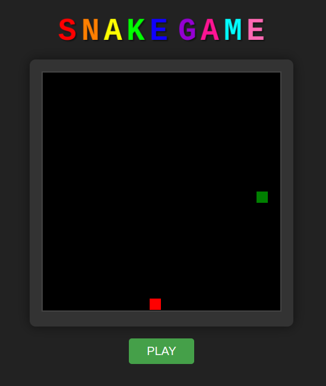 | 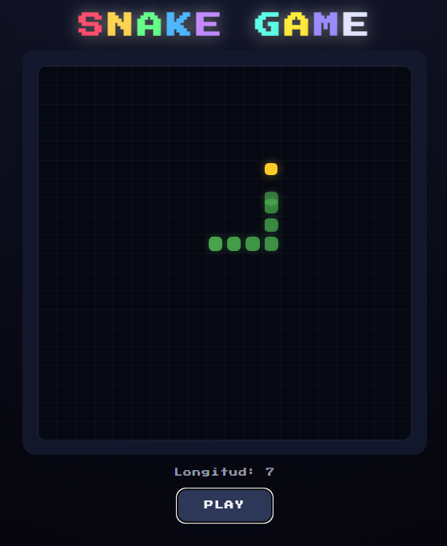 | 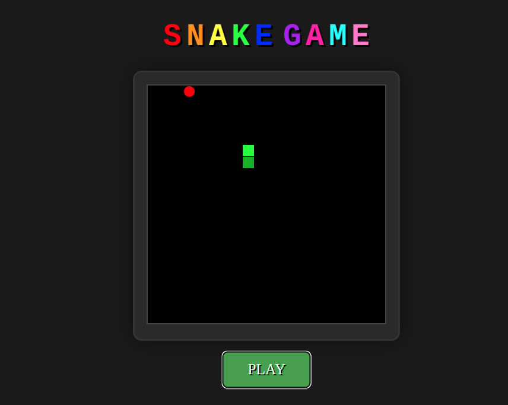 | 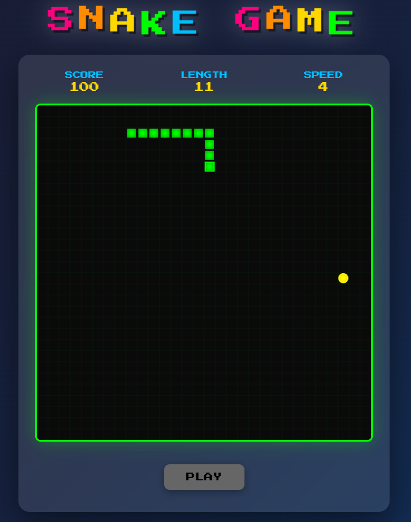 |

| Grok Code Fast1 | DeepSeek R1 | Gemini 2.5 Pro | Gemini 2.0 |
|:-----:|:----------:|:---------:|:---------:|
| 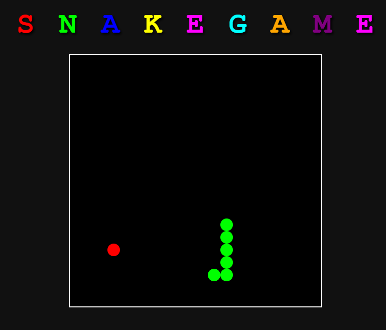 | 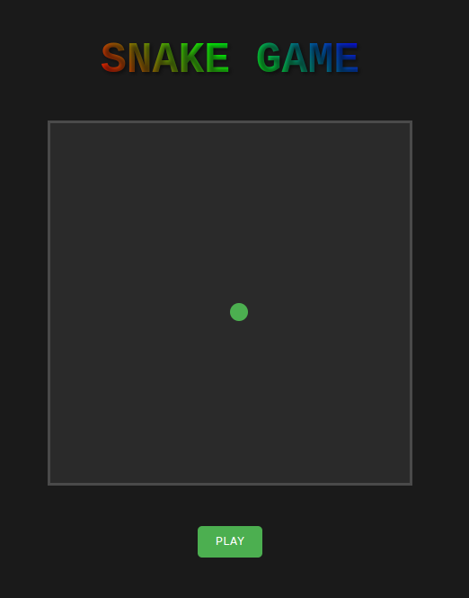 | 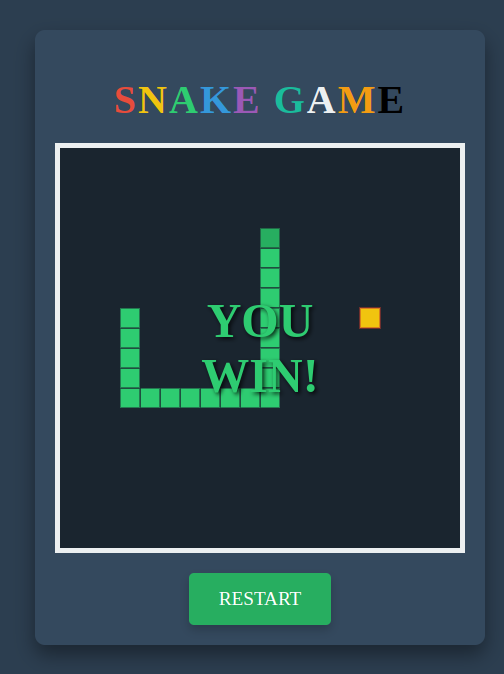 | 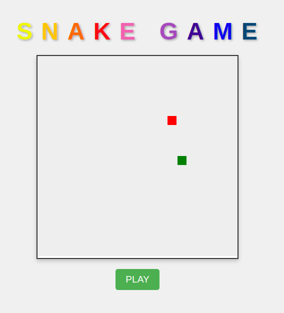 |

| Llama 3.3 | Phi 4 | Qwen 2.5 |
|:-----:|:----------:|:---------:|
| 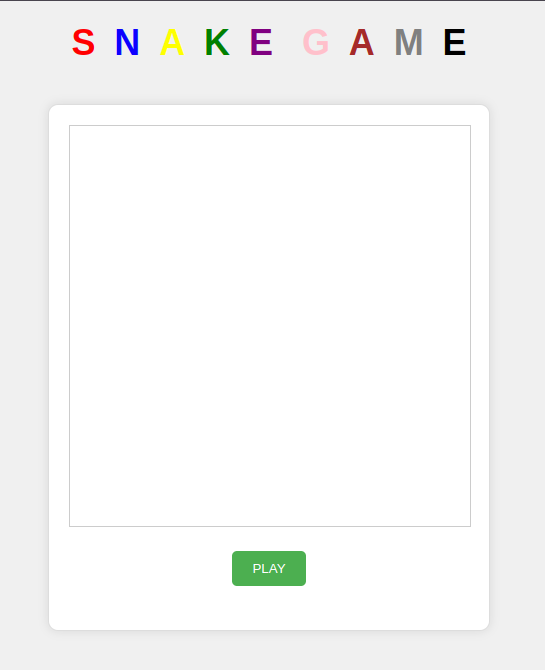 | 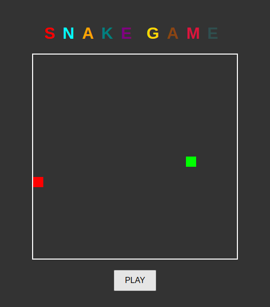 | 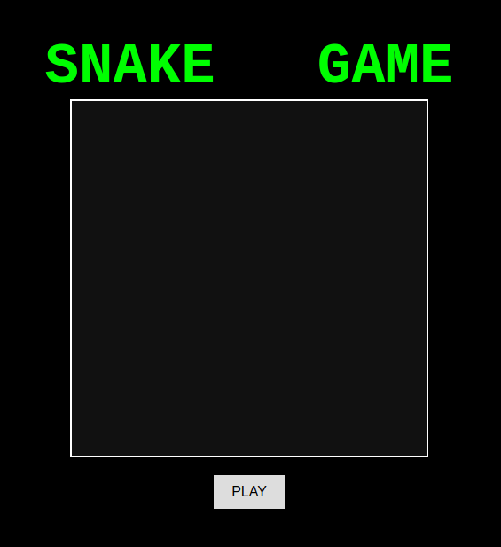 |

---

## 📜 Conclusión 🤔

El juego **SNAKE** ofrece múltiples enfoques de implementación, desde simples bucles hasta complejas redes neuronales. Cada solución tiene sus ventajas y desafíos, y su elección depende del contexto de aplicación.

En este experimento, se ha analizado la influencia de distintos **LLMs** en la generación de código, permitiendo comparar su capacidad para optimizar, estructurar y mejorar las soluciones propuestas. Se ha evidenciado que grandes modelos como **GPT-4**, **GPT-5 Codex**, **Claude 3.5**, **Claude 4.5**, **Grok Code Fast1** y **Gemini 2.5 Pro** son los más destacados en términos de capacidad para generar código `HTML` para juegos, con una excelente interpretación del prompt y una jugabilidad efectiva 🎮.

Los nuevos modelos evaluados (**Claude 4.5**, **GPT-5 Codex** y **Grok Code Fast1**) han demostrado un rendimiento excepcional, con **GPT-5 Codex** y **Claude 4.5** destacándose por su aspecto visual superior y pulido. Los tres modelos nuevos han interpretado correctamente el prompt y han generado código funcional de alta calidad sin necesidad de mejoras adicionales, confirmando la evolución positiva de estas tecnologías.

Por otro lado, modelos que han sido entrenados con datos de código pueden generar soluciones preexistentes en lugar de crear una nueva implementación basada en el prompt, lo que puede derivar en un cierto sesgo de *overfitting*. Evaluar estas herramientas en escenarios prácticos ayuda a entender sus beneficios y limitaciones en el desarrollo de software.

Un prompt más elaborado y desde luego varias interacciones con estos modelos, hubieran dado un resultado más elaborado. En cualquier caso, el uso de estos modelos pueden servir como punto base para desarrollos más complejos pero sin olvidar de la importancia de la interpretabilidad del código.

---
## 💻 Archivos HTML

A continuación, encontrarás los enlaces a los archivos HTML generados para cada implementación del juego SNAKE. Haz clic en cada enlace para abrir los archivos en una nueva pestaña del navegador:

- <a href="snake_game_by_GPT-4o.html" target="_blank">Juego SNAKE - Implementación GPT-4o</a>
- <a href="snake_game_by_GPT_5_Codex.html" target="_blank">Juego SNAKE - Implementación GPT-5 Codex</a>
- <a href="snake_game_by_Claude_3.5_Sonnet .html" target="_blank">Juego SNAKE - Implementación Claude 3.5 Sonnet</a>
- <a href="snake_game_by_Claude_4.5_Sonnet.html" target="_blank">Juego SNAKE - Implementación Claude 4.5 Sonnet</a>
- <a href="snake_game_by_Grok_Code_Fast1.html" target="_blank">Juego SNAKE - Implementación Grok Code Fast1</a>
- <a href="snake_game_by_DeepSeek_R1.html" target="_blank">Juego SNAKE - Implementación DeepSeek R1</a>
- <a href="snake_game_by_Gemini_2.0_Flash.html" target="_blank">Juego SNAKE - Implementación Gemini 2.0 Flash</a>
- <a href="snake_game_by_Gemini_2.5_Pro.html" target="_blank">Juego SNAKE - Implementación Gemini 2.5 Pro</a>
- <a href="snake_game_by_Llama3.3-70b.html" target="_blank">Juego SNAKE - Implementación Llama 3.3 70b</a>
- <a href="snake_game_by_Phi4.html" target="_blank">Juego SNAKE - Implementación Phi 4</a>
- <a href="snake_game_by_Qwen2.5-Coder-32b.html" target="_blank">Juego SNAKE - Implementación Qwen 2.5 Coder 32b</a>

---
## 🔗 Referencias

- [Historia del juego Snake - Wikipedia](https://es.wikipedia.org/wiki/Snake_(videojuego))

---

¡Espero que este análisis te haya resultado interesante! 🚀

---

**Última actualización:** 18 de octubre de 2025
