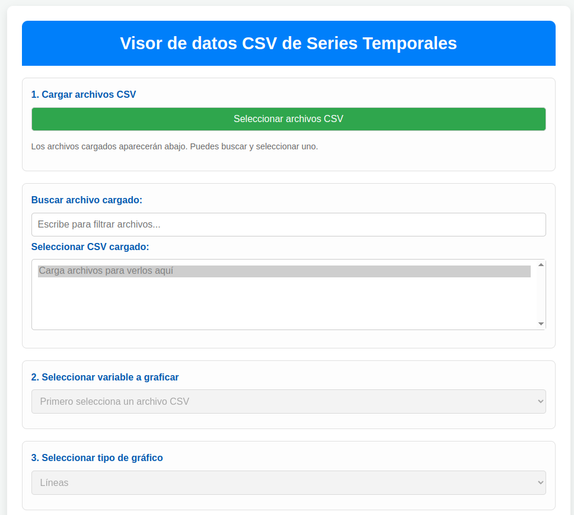

# 📊 Visualizador de CSV de Series Temporales



## 📌 Introducción

El **Visualizador de CSV de Series Temporales** es una herramienta web interactiva desarrollada en HTML, CSS y JavaScript que permite analizar y visualizar datos temporales almacenados en archivos CSV. Esta aplicación está especialmente diseñada para trabajar con series de tiempo que contengan columnas de fecha y hora, proporcionando análisis estadísticos detallados y múltiples tipos de visualizaciones.

La herramienta utiliza las bibliotecas **Papa Parse** para el procesamiento de archivos CSV y **Plotly.js** para la generación de gráficos interactivos, ofreciendo una experiencia de usuario completa y profesional para el análisis de datos temporales.

## 🚀 Características Principales

### 📁 Gestión de Archivos
- **Carga múltiple de archivos CSV** con validación automática
- **Búsqueda y filtrado** de archivos cargados
- **Procesamiento automático** de fechas en formato DD/MM/YYYY y horas numéricas
- **Validación de estructura** de datos temporales

### 📈 Tipos de Visualización
1. **Gráfico de Líneas Temporal**
   - Visualización de series temporales con marcadores y líneas suavizadas
   - Análisis de tendencia mediante regresión lineal
   - Detección de patrones estacionales
   - Filtrado por rangos de fechas personalizables

2. **Histograma**
   - Distribución de frecuencias de los valores
   - Análisis de la distribución estadística de los datos

3. **Diagrama de Caja (Boxplot)**
   - Visualización de cuartiles y valores atípicos
   - Identificación automática de outliers usando el método IQR
   - Tabla detallada de valores atípicos con opciones de descarga

4. **Autocorrelación (ACF)**
   - Análisis de correlación temporal de la serie
   - Límites de confianza estadística
   - Identificación de patrones repetitivos

### � Análisis Estadístico Completo
- **Métricas básicas**: Min, Max, Media, Desviación Estándar, Mediana
- **Percentiles completos**: P5, P10, P25, P50, P75, P90, P95
- **Conteo de valores**: Registros válidos, valores faltantes, total de registros
- **Análisis de calidad de datos** con identificación de valores ausentes

### 🎛️ Funcionalidades Interactivas
- **Filtrado temporal** con selectores de fecha inicio y fin
- **Controles de análisis** para mostrar/ocultar tendencia y estacionalidad
- **Descarga de resultados** en formato CSV y HTML para valores atípicos
- **Nomenclatura automática** de archivos con variable y rango temporal
- **Interfaz responsive** adaptable a diferentes dispositivos

## 🔧 Estructura Técnica

### Algoritmos Implementados
- **Regresión lineal** para cálculo de tendencias
- **Descomposición estacional** con patrones periódicos configurables
- **Media móvil** para suavizado de series
- **Método IQR** para detección de valores atípicos
- **Función de autocorrelación** con límites de confianza

### Tecnologías Utilizadas
- **HTML5** para la estructura de la aplicación
- **CSS3** con Grid y Flexbox para diseño responsive
- **JavaScript ES6+** para la lógica de aplicación
- **Papa Parse 5.3.2** para procesamiento de CSV
- **Plotly.js** para visualizaciones interactivas

## 📋 Formato de Datos Esperado

El visualizador espera archivos CSV con la siguiente estructura:

```csv
Fecha,Hora,Variable1,Variable2,...
01/01/2023,0,18.5,1013.2
01/01/2023,6,16.2,1015.8
01/01/2023,12,24.7,1012.4
01/01/2023,18,22.1,1014.6
```

**Requisitos:**
- Primera columna: Fecha en formato DD/MM/YYYY
- Segunda columna: Hora como número entero (0-23)
- Columnas adicionales: Variables numéricas a analizar
- Encabezados obligatorios en la primera fila

## 🎯 Casos de Uso

### Análisis Meteorológico
- Visualización de temperaturas, presión atmosférica, humedad
- Detección de patrones estacionales y tendencias climáticas
- Identificación de eventos extremos (olas de calor, frío intenso)

### Monitoreo Industrial
- Análisis de sensores de temperatura, presión, flujo
- Control de calidad en procesos industriales
- Detección de anomalías en equipamiento

### Análisis Energético
- Consumo eléctrico por horas y estaciones
- Generación de energía renovable (solar, eólica)
- Optimización de demanda energética

### Investigación Científica
- Análisis de datos experimentales temporales
- Estudios longitudinales con mediciones periódicas
- Validación de hipótesis con análisis estadístico

## 🔍 Funcionalidades Avanzadas

### Sistema de Métricas
La herramienta calcula automáticamente:
- **Estadísticas descriptivas** completas
- **Análisis de completitud** de datos
- **Distribución percentílica** detallada
- **Métricas de dispersión** y centralidad

### Detección de Outliers
- **Método IQR** (Rango Intercuartílico) para identificación robusta
- **Clasificación** en outliers superiores e inferiores
- **Exportación detallada** con fecha, hora y valor del outlier
- **Nomenclatura inteligente** de archivos de descarga

### Análisis Temporal Avanzado
- **Descomposición de series** en tendencia, estacionalidad y ruido
- **Suavizado adaptativo** con ventanas móviles
- **Autocorrelación** para detección de periodicidades
- **Filtrado temporal** preciso por rangos de fechas

## � Opciones de Exportación

### Descarga de Outliers
Los valores atípicos pueden descargarse en dos formatos:

**CSV**: Formato tabular para análisis adicional
```
Indice,Fecha-Hora,Valor,Tipo
45,"15/07/2023 12:00",45.7,Superior
```

**HTML**: Reporte formateado con estilo profesional
- Tabla estilizada con información completa
- Resumen estadístico de outliers
- Marca temporal de generación

### Nomenclatura Automática
Los archivos se nombran automáticamente siguiendo el patrón:
`valores_atipicos_[Variable]_desde_[FechaInicio]_hasta_[FechaFin].[extension]`

Ejemplo: `valores_atipicos_Temperatura_desde_20230101_hasta_20231231.csv`

## 🎨 Interfaz de Usuario

### Diseño Responsive
- **Layout adaptativo** que funciona en desktop, tablet y móvil
- **Controles intuitivos** con indicadores visuales claros
- **Feedback inmediato** para todas las acciones del usuario

### Experiencia de Usuario
- **Flujo guiado** paso a paso para el análisis
- **Mensajes informativos** que guían al usuario
- **Validaciones en tiempo real** para prevenir errores
- **Indicadores de progreso** durante el procesamiento

## 🔬 Ejemplo de Uso Completo

1. **Cargar datos**: Seleccionar archivo CSV con datos meteorológicos
2. **Elegir variable**: Seleccionar "Temperatura" de la lista desplegable
3. **Configurar filtros**: Establecer rango de fechas de verano (21/12 - 21/03)
4. **Analizar métricas**: Revisar estadísticas descriptivas automáticas
5. **Visualizar**: Generar gráfico de líneas con tendencia y estacionalidad
6. **Detectar outliers**: Cambiar a boxplot para identificar valores extremos
7. **Exportar resultados**: Descargar tabla de outliers en formato CSV

## 🚧 Limitaciones y Consideraciones

### Formato de Datos
- Requiere estructura específica con fecha y hora en primeras columnas
- Fechas deben estar en formato DD/MM/YYYY
- Horas como números enteros (0-23)

### Rendimiento
- Optimizado para archivos de tamaño medio (hasta ~100,000 registros)
- El procesamiento se realiza en el navegador (client-side)
- Tiempos de carga dependientes del hardware del usuario

### Compatibilidad
- Requiere navegador moderno con soporte ES6+
- JavaScript habilitado obligatorio
- Conexión a internet para librerías CDN

## 🔮 Futuras Mejoras

### Funcionalidades Planificadas
- **Comparación multi-variable** en un mismo gráfico
- **Análisis de correlación** entre variables
- **Predicción básica** usando tendencias identificadas
- **Exportación de gráficos** en formatos PNG/SVG
- **Plantillas predefinidas** para diferentes tipos de análisis

### Optimizaciones Técnicas
- **Procesamiento lazy** para archivos grandes
- **Cache inteligente** de cálculos estadísticos
- **Worker threads** para cálculos intensivos
- **Modo offline** con service workers


---

💻 **Archivo**: [csv_temporal_visualizer.html](csv_temporal_visualizer.html)

🔗 **Demo en vivo**: Abre el archivo HTML en tu navegador para comenzar a explorar tus datos temporales.